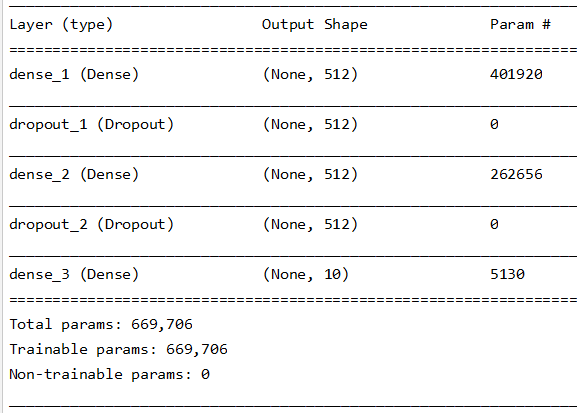
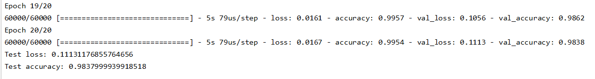
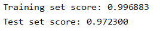
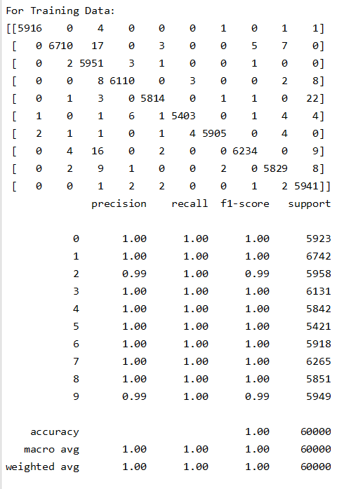
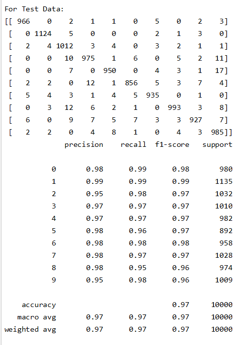

# Deep Learning - MLP on MNIST Dataset

## Deep Learning Homework 3 No. 9 | Indra Imanuel Gunawan - 20195118
There are two python files in this repository, one is an implementation of MLP on MNIST dataset using Keras, while the other one uses Scikit-learn. I will explain about the Keras implementation first, then the scikit-learn one.

## Keras Implementation

## Setup
Install keras\
`pip install keras`

# Run
To run the code, just type this on the terminal (make sure that the directory & environment is correct):\
`python MLP_Keras_MNIST.py`

## Results
Here are the summary of the model that has been created in this experiment, and the accuracy of the model when working on the "MNIST dataset"
### Model Summary

### Model Accuracy


## Code Explanation
First, import the required libraries and necessary modules
```python
import keras
from keras.datasets import mnist
from keras.models import Sequential
from keras.layers import Dense, Dropout
from keras.optimizers import RMSprop
```

Set the batch size, number of classes, and number of epoch in this experiment
```python
batch_size = 128
num_classes = 10
epochs = 20
```

Load the data, and split it to train and test data
```python
(x_train, y_train), (x_test, y_test) = mnist.load_data()
```

Reshape and normalize the X so that it can be fed to the model. Also, convert the y to binary class matrices.
```python
x_train = x_train.reshape(60000, 784)
x_test = x_test.reshape(10000, 784)
x_train = x_train.astype('float32')
x_test = x_test.astype('float32')
x_train /= 255
x_test /= 255

# convert class vectors to binary class matrices
y_train = keras.utils.to_categorical(y_train, num_classes)
y_test = keras.utils.to_categorical(y_test, num_classes)
```

Create a sequential model. This model consist of 1 input layer, 1 hidden layer, and 1 output layer, in which each of those layers are followed by a dropout layer with a 0.2 rate. Each layer use relu activation function, except for the output which uses softmax activation.
```python
model = Sequential()
model.add(Dense(512, activation='relu', input_shape=(784,)))
model.add(Dropout(0.2))
model.add(Dense(512, activation='relu'))
model.add(Dropout(0.2))
model.add(Dense(num_classes, activation='softmax'))

model.summary()
```

Compile and fit the model to the data. The model uses categorical cross entropy for the loss function, and Adam as the optimizer
```python
model.compile(loss='categorical_crossentropy',
              optimizer=RMSprop(),
              metrics=['accuracy'])

history = model.fit(x_train, y_train,
                    batch_size=batch_size,
                    epochs=epochs,
                    verbose=1,
                    validation_data=(x_test, y_test))
```

See the accuracy of the model
```python
score = model.evaluate(x_test, y_test, verbose=0)
print('Test loss:', score[0])
print('Test accuracy:', score[1])
```

## Scikit-learn Implementation

## Setup
Install scikit-learn\
`pip install scikit-learn`

## Run
To run the code, just type this on the terminal (make sure that the directory & environment is correct):\
`python MLP_ScikitLearn_MNIST.py`

## Results
The results of the experiment include:
1. The program's accuracy on the training and test dataset
2. The confusion matrix on the training and test dataset
3. The classification report on the training and test dataset
Explanation on how to get these results from the code will be explained in the "Code Explanation" section.

### Accuracy

### Confusion Matrix & Classification Report
#### Training Dataset

#### Test Dataset


## Code Explanation
First, import the required libraries and necessary modules
```python
from sklearn.datasets import fetch_openml
from sklearn.neural_network import MLPClassifier
from sklearn.metrics import classification_report, confusion_matrix
```

Load and normalize the data, then split it to train and test dataset
```python
X, y = fetch_openml('mnist_784', version=1, return_X_y=True)
X = X / 255.

# rescale the data, use the traditional train/test split
X_train, X_test = X[:60000], X[60000:]
y_train, y_test = y[:60000], y[60000:]
```

Build the model using the MLPClassifier and fit the training data into it
```python
mlp = MLPClassifier(hidden_layer_sizes=(50,), max_iter=10, alpha=1e-4,
                    solver='sgd', verbose=10, random_state=1,
                    learning_rate_init=.1)

mlp.fit(X_train, y_train)
predict_train = mlp.predict(X_train)
predict_test = mlp.predict(X_test)
```

This code below is used to see the accuracy of the model:
```python
print("Training set score: %f" % mlp.score(X_train, y_train))
print("Test set score: %f" % mlp.score(X_test, y_test))
```

This code below is used to see the Confusion matrix and Classification Report
```python
#Compare Training data result & original
print("For Training Data:")
print(confusion_matrix(y_train, predict_train))
print(classification_report(y_train, predict_train))

#Compare Test data result & original
print("For Test Data:")
print(confusion_matrix(y_test, predict_test))
print(classification_report(y_test, predict_test))
```
